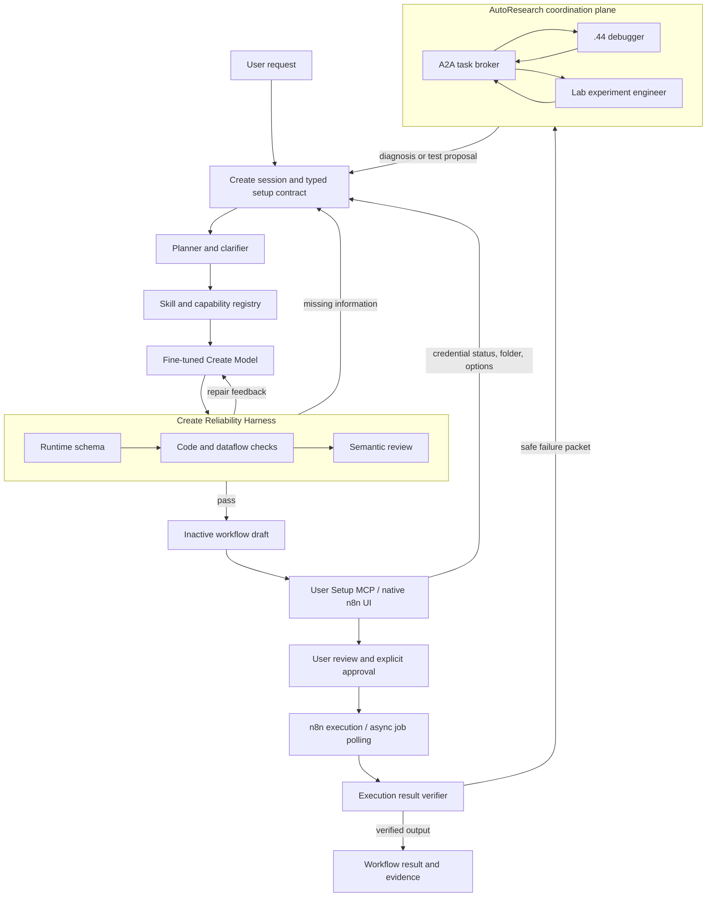

# Target Architecture: Execution-First n8n Workflow Research

## Purpose

The target is not an agent that produces workflow JSON and stops. It is a
human-supervised system that helps a user reach a verified n8n outcome: the
workflow is understandable, configured with the user's own credentials, executed
with approval, and checked against an observable result.

The current Create Reliability Harness remains a gatekeeper. It prevents known
structural, dataflow, and semantic failures from reaching n8n. The new layers fill
the gap exposed by workflows such as AI video generation: selecting supported
capabilities, collecting setup information, and checking asynchronous execution.

## Target Flow



## Architectural Responsibilities

| Layer | Responsibility | Must not do |
| --- | --- | --- |
| Create session | Retain clarified facts and the contract across turns | Treat displayed chat history as state |
| Skill registry | State supported nodes, versions, parameter schemas, auth type, costs, and test method | Invent an unavailable community node |
| Create Model | Produce a candidate workflow from a selected skill plan | Receive credential values |
| Reliability Harness | Check schema, connections, Code dataflow, and semantic contract | Claim runtime output correctness without execution evidence |
| Draft lifecycle | Materialize only a validated inactive draft and show setup gaps | Activate, publish, or execute silently |
| User Setup MCP | Ask the UI to collect choices and open native credential setup | Read OAuth tokens, API keys, or credential values |
| Execution verifier | Confirm an allowed execution's declared output and delivery evidence | Start external side effects without user approval |
| A2A plane | Hand off sanitized diagnosis and experiment tasks between agents | Carry secrets, raw executions, or authorization to change production |

## Skill and Capability Registry v0

A skill is a versioned capability description, not a prompt fragment. Every skill
must declare:

```text
skill id and version
supported n8n node type/version or generic HTTP Request recipe
input fields and validation rules
required credential kind and non-secret credential reference
side effects and expected cost/rate-limit risk
asynchronous job behavior and polling/result rule
delivery/output evidence required for pass
safe fixture or dry-run availability
```

The first useful registry entries should be:

1. `http-request-api-v1`: generic, runtime-supported API invocation.
2. `google-drive-upload-v1`: native Google Drive upload and folder selection.
3. `video-generation-http-v1`: a provider-specific HTTP recipe only after its
   current API specification, headers, asynchronous job states, and pricing policy
   have been reviewed.

An unsupported community node is not a skill. The registry must report that fact and
offer a supported alternative or a setup requirement.

## User Setup MCP Boundary

The proposed User Setup MCP is an internal, UI-facing contract. It is not permission
to expose n8n credentials to the model.

```text
requestCredentialSetup(provider, scopes) -> connected | canceled | needs_user_action
requestFolderSelection(provider)          -> selected folder reference | canceled
requestConfiguration(fields)              -> typed non-secret values | incomplete
requestCostApproval(summary)              -> approved | declined
requestExecutionApproval(summary)         -> approved | declined
```

Only labels, stable references, and completion states return to the planner. OAuth
tokens, client secrets, and provider API keys remain inside n8n's credential store.

## Lab Workstation Role

The lab workstation is initially the `experiment-engineer`, not a general always-on
agent. It receives a bounded task, runs only the declared local check, posts a
sanitized result, and becomes idle again. Its first permitted task classes are
`light` and approved `cpu-bound` offline evaluation. It must not run models,
deployments, n8n operations, or credential setup automatically.

Before it can join the broker, it needs a separate, revocable agent identity. The
current broker token is server-local and must not be copied to another computer.

## Known Gaps Between Current and Target

| Capability | Current state | Target state |
| --- | --- | --- |
| Candidate validation | Implemented and deployed | Keep and broaden with skills |
| User clarification | Individual prompts, not durable setup state | Persistent typed Create session |
| Credentials | Native manual n8n setup only | Guided setup status without secret disclosure |
| Draft workflow | Prototype exists but is not production-integrated | Validated inactive draft plus checklist |
| External async jobs | No generic lifecycle | Provider skill: submit, poll, retrieve, verify |
| Execution correctness | Exact evidence utilities, not standard Create gate | Opt-in result verifier per safe skill |
| Multi-agent handoff | Server broker plus .44 debugger | Add scoped lab agent identity and task monitor |
| Monitoring | Server logs and task file only | Sanitized task board with state, owner, age, and evidence link |
