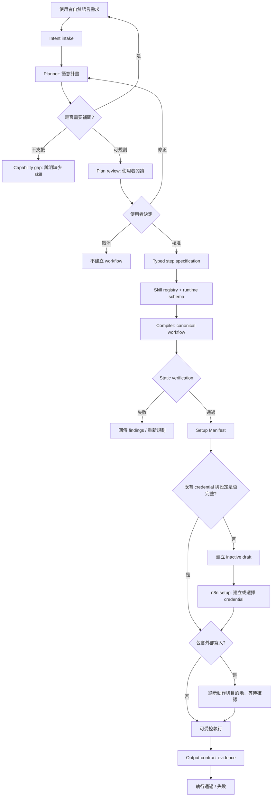

# Runtime-Aware n8n Workflow 系統規格

**版本：** 0.1  
**適用分支：** `codex/autoresearch-a2a`  
**最後更新：** 2026-08-25

> 這是一份架構規格，不是宣傳稿。每項能力均標示為「已驗證」、「已有程式骨架」或「尚未實作」。除非寫為已驗證，系統不可對使用者宣稱該能力已可用。

## 1. 問題與前因

本研究的原始做法是以微調後的 Create model，將自然語言直接生成完整 n8n workflow JSON。這條路有明確價值：模型已學到 workflow 的基本結構，能快速產出雛形。然而實測也暴露了根本限制：模型訓練時看到的 n8n 節點型別、版本、參數名稱與連線埠，可能已和目前執行中的 n8n runtime 不一致。

這不是單純 JSON 格式問題。JSON 可以合法，workflow 仍可能因為節點不存在、參數改名、type version 不相容、連線埠不同、credential 未設定，或資料形狀錯誤而無法執行。過去 Easy-100 的 runtime-aware 批次觀察到，大部分候選 workflow 仍被 runtime 靜態檢查阻擋；這表示「重新要求模型輸出一份 JSON」不是可靠的修復策略。

因此本系統把責任拆開：模型處理使用者真正想自動化的事情；由 runtime-aware compiler 根據**目前安裝的 n8n schema**，用受控的 skill 組裝 workflow。目標不是保證每個自然語言需求都能建立，而是讓每個結果都有可理解的狀態：可規劃、需要補問、目前不支援、可建立草稿、可執行，或已由輸出契約驗證。

## 2. 產品承諾與非承諾

### 2.1 產品承諾

1. 不把「看起來合理的 JSON」誤稱為可執行 workflow。
2. 使用者在 JSON 建立前，能先閱讀並修正語意計畫。
3. 已存在的 credential 可直接綁定；不存在的 credential 不阻止建立完整的 inactive draft。
4. API key、OAuth token、密碼與真正的個人敏感資料不會交給 planner 或 compiler。
5. 每次外部寫入或真正執行前，都有可見的確認邊界。
6. 不支援的需求要明講缺少哪個 capability/skill，而不是假裝已建立 workflow。

### 2.2 本版本不承諾

1. 不承諾所有 n8n 節點或社群 template 都可自動遷移。
2. 不承諾靜態驗證通過就代表商業語意、權限或外部服務結果正確。
3. 不承諾 planner 可自行取得 credential、替使用者建立外部帳號，或知道私有 API 的正確欄位。
4. 不承諾目前的 Compiler Beta 是通用自然語言生成器；正式測試版目前只包含少數受驗證 pattern。

## 3. 共同事實與責任分界

整套流程必須共用同一份 canonical workflow representation：一份由 compiler 產生、含 runtime schema revision 的標準 workflow。生成、靜態驗證、credential binding、建立 draft 與執行證據都必須引用它，而不是各自重建不同 JSON。

| 元件 | 負責什麼 | 明確禁止什麼 |
| --- | --- | --- |
| Planner | 理解目標、提出澄清問題、產生人可讀 plan、選擇宣告式 capability | 產生 raw n8n JSON、讀取 secret、任意 JavaScript |
| Plan Review Gate | 建立 plan fingerprint、保證只有使用者核准的同一版計畫可編譯 | 讓舊核准通過新版計畫 |
| Skill Registry | 宣告 compiler 真正擁有的 capability、風險、credential/configuration 要求 | 把「n8n 裝了某節點」誤記為系統已支援 |
| Compiler | 使用當前 runtime schema、組裝節點/參數/連線與受控程式碼模板 | 猜測未宣告的商業語意或任意修補 |
| Static Verifier | 檢查節點型別、版本、參數、連線、policy 與宣告的輸出契約 | 宣稱 workflow 已在真實服務成功執行 |
| Setup Manifest | 列出 credential 身分與使用者要填的 configuration；決定草稿是否 inactive | 保存 API key、token、密碼或把它們送給模型 |
| n8n Setup UI | 選擇/建立 credential、填寫 private configuration、執行 workflow | 透過聊天把 secret 回傳模型 |
| Execution Verifier | 根據明確 output contract 蒐集執行證據 | 無證據地標示 success |

## 4. 端到端流程



### 4.1 狀態機

| 狀態 | 進入條件 | 使用者能做什麼 | 系統禁止什麼 |
| --- | --- | --- | --- |
| `intake` | 收到需求 | 描述或補充目標 | 直接編譯 |
| `clarification_required` | 關鍵語意不足 | 回答具體問題 | 猜測會改變流程的資訊 |
| `capability_gap` | 需要的 skill 不存在 | 儲存需求、換模式、等待新 skill | 偽造骨架為完成結果 |
| `plan_review_required` | planner 可提出可讀計畫 | 核准、修正、取消 | 尚未核准就輸出 JSON |
| `plan_revision_requested` | 使用者提出修正 | 等待新版 plan | 以舊 plan 的核准編譯新版 |
| `plan_approved` | fingerprint 對應的 plan 被核准 | 進入編譯 | 改動 plan 而不重新核准 |
| `static_validation_failed` | canonical workflow 不相容 runtime | 看 findings、修正計畫 | 建立為 ready workflow |
| `ready_to_create_draft` | 靜態通過但 setup 尚缺 | 建立 inactive draft | 自動執行 |
| `setup_required` | draft 已建立且仍缺 credential/config | 到 n8n 完成 setup | 在聊天索取 secret |
| `confirm_external_write` | workflow 會寄信、上傳、刪除或寫外部系統 | 確認或取消 | 默默執行外部寫入 |
| `ready_to_run` | setup 完整、必要確認已完成 | 在 n8n 執行 | 宣稱已有結果 |
| `execution_passed/failed` | 有輸出契約與執行證據 | 啟用、保存、修改或除錯 | 用靜態結果取代執行證據 |

## 5. 使用者體驗規則

### 5.1 先規劃，再建立

使用者看到的是短 plan，而不是 JSON。例如：

```text
目標：每天彙整指定 RSS 的十篇新文章並寄給團隊。
步驟：排程 -> 讀取 RSS -> 篩選與去重 -> 限制十篇 -> 產生 Markdown -> 寄送 email。
需要設定：SMTP credential、寄件人、收件人。
預期輸出：一封含十篇文章的 Markdown digest。

[核准建立草稿] [修改計畫] [取消]
```

使用者若說「改成只保留 12 小時內的文章」，系統必須把整份 plan 作為新版，產生新 fingerprint，再次要求核准。

### 5.2 何時詢問 configuration

採混合策略：

- **會改變 workflow 拓樸或語意**的值在 planning 前或 review 時詢問。例如：要寄 Email 還是 Slack、每 30 秒還是每日、成功後上傳還是刪除。
- **不會改變拓樸、但執行前必填**的值可在 draft 後由 Setup Manifest 收集。例如：寄件人、收件人、特定 folder ID。
- **secret 或高度敏感資料**不進聊天。使用者只在 n8n credential UI 或受隔離的 setup form 設定。

### 5.3 Credential 行為

1. 系統只查 credential 的可選名稱、服務類型與可用狀態。
2. 若已有對應 credential：綁定名稱/ID，compiler 與 planner 都不會看到 value。
3. 若沒有：仍建立包含該節點的 inactive draft，回覆「需建立 A、B、C credential」與跳轉 n8n 的 setup 指引。
4. 若 workflow 有外部寫入，即使 credential 已就緒，也要在執行前確認目的地與動作。

## 6. Skill 與 compiler

Skill 不是單純 prompt，也不是任意的 rule-based function。它是一份明確能力契約：說明可接受什麼語意輸入、需要什麼 setup、允許 compiler 組裝什麼 runtime node、可能的風險、驗證方式與拒絕條件。模型可選擇與排列 skill；compiler 則必須照 skill 合約產生 runtime JSON。

### 6.1 目前 registry 中的能力

| Skill | 狀態 | 風險 | 說明 |
| --- | --- | --- | --- |
| `trigger.manual` | 已實作 | read only | 手動觸發 |
| `http.public_get` | 已實作 | read only | 固定公開 HTTPS GET |
| `transform.select_fields` | 已實作 | read only | 單一物件選欄位 |
| `transform.count_false_boolean` | 已實作 | read only | 統計布林 false |
| `transform.join_object_and_count` | 已實作 | read only | 合併物件與 items 統計 |
| `output.one_object` | 已實作 | read only | 明確單一物件輸出 |
| `workflow.daily_rss_digest` | 已驗證 prototype | read only | 排程、RSS、篩選、限制與 Markdown digest |
| `delivery.smtp_email_draft` | 已驗證 draft prototype | external write | 可建立 email draft；需 SMTP、寄件人與收件人 |
| `http.authenticated_request` | 尚未實作 | external write | 需設計 credential binding 與允許的請求 schema |
| `control.flow` | 尚未實作 | read only | 通用 IF/Wait/Retry/迴圈 |

### 6.2 已驗證 evidence

- Public selection workflow：建立、readback、手動執行皆成功。
- Todo aggregation / C07：建立、readback、手動執行成功，輸出 `name`、`email`、`totalTodos`、`incompleteTodos`。
- Twitch status：建立、readback、手動執行成功。
- RSS digest：建立並手動執行成功，產出 10 筆 Markdown digest。
- RSS email draft：workflow 建立與 readback 成功；尚未以 SMTP credential 進行真實寄送驗證。

這些是受限 pattern 的 evidence，不可外推為「能生成任意 n8n workflow」。

## 7. 資料與隱私模型

### 7.1 可進 planner 的資料

- 使用者的非敏感目標、限制、期望輸出。
- 抽象 capability，例如「需要 Google Drive 上傳」。
- runtime skill ID、schema revision、是否存在符合服務類型的 credential。
- placeholder，例如 `{{recipient_email}}`；不可使用真正 email。

### 7.2 不可進 planner/compiler/log 的資料

- API key、token、password、OAuth client secret、authorization header。
- 真實 credential value。
- 未經遮罩的私人地址、個資或使用者上傳的敏感內容。

### 7.3 Setup Manifest v1

此 manifest 是 planning/compile 後、n8n setup 前的交接契約。範例：

```json
{
  "schemaVersion": "1.0",
  "kind": "runtime_setup_manifest",
  "planFingerprint": "sha256...",
  "skillIds": ["delivery.smtp_email_draft"],
  "workflowDisposition": "create_inactive_draft",
  "items": [
    {
      "kind": "credential",
      "key": "SMTP credential",
      "status": "setup_required",
      "bindStrategy": "create_or_select_in_n8n",
      "modelVisibility": "never",
      "sensitive": true
    },
    {
      "kind": "configuration",
      "key": "recipient email",
      "status": "setup_required",
      "modelVisibility": "placeholder_only",
      "sensitive": true
    }
  ]
}
```

此契約目前已有可測函式與單元測試；尚未接上 production chat UI 與 n8n credential API。

## 8. 現在實作到哪裡

| 層次 | 狀態 | 位置或證據 |
| --- | --- | --- |
| Fine-tuned Create 路線 | 已有舊系統/比較基線 | `ollama-widget` 部署測試分支 |
| Compiler Beta 固定 patterns | 已部署測試 | `ollama-widget` 的 deployed revision |
| Nodewise compiler | 已驗證多個受限 pattern | A2A autoresearch evidence |
| Skill registry | 已有程式與測試 | `chatbot/src/runtimeSkillRegistry.js` |
| Plan review fingerprint gate | 已有程式與測試 | `chatbot/src/planReviewGate.js` |
| Setup Manifest | 已有程式與測試 | `chatbot/src/setupManifest.js` |
| Planner model 選型 | 研究中 | Sol 表現較強；尚無正式 API integration |
| 通用 planner session/chat UI | 尚未接線 | 必須建立 session persistence 與 review controls |
| 真實 credential lookup/binding | 尚未接線 | 只完成 privacy/data contract |
| 高風險 workflow compilation | 尚未實作 | authenticated HTTP、Wait/IF/Retry、Drive、通知等 |
| 自動執行驗證 | 尚未通用實作 | 已有手動 n8n execution evidence |

## 9. 下一個實作順序

1. **Planner Session v1**：將 plan review gate 接到聊天 endpoint/UI，保存 `planFingerprint`、revision 與使用者決定。
2. **Draft handoff v1**：將 approved typed spec -> compiler -> static verifier -> Setup Manifest -> inactive draft 串成單一路徑。
3. **Credential binding adapter**：讀取 n8n credential metadata，讓使用者在 native UI 選擇，不暴露 value。
4. **擴充高覆蓋 skill**：優先 authenticated HTTP、資料映射、IF/Wait/Retry，並為每個 skill 加上可執行 fixture。
5. **Execution evidence**：定義每個 skill 的 output contract，將實際 execution ID、輸出與錯誤分類寫入非敏感研究紀錄。

## 10. 對抗式審查清單

另一個 AI 或測試者可以用這些問題挑戰系統：

1. 使用者未核准 plan，系統是否仍可能生成 workflow JSON？答案必須是「不可以」。
2. 使用者要求新版 plan，但按了舊版的核准按鈕，是否能編譯？答案必須是「不可以」。
3. 使用者把 API key 打進聊天，系統能否保證它不進 planner history？目前尚未完成端到端 UI redaction，因此正確回答是「設計要求如此，但 UI 尚未實作，不應宣稱已保證」。
4. 找不到 Google Drive credential 時，系統是否拒絕建立全部 workflow？答案必須是「不應拒絕；應建立 inactive draft 與 setup checklist」，前提是該 Google Drive skill 已被實作。
5. 一個 n8n 節點存在，是否代表 compiler 支援它？答案必須是「不代表」。
6. 靜態驗證通過是否代表寄信成功？答案必須是「不代表；需 execution evidence」。
7. Planner 能否任意輸出 JavaScript 或 node type？答案必須是「不可以；只可輸出 typed specification，compiler 擁有 JSON」。
8. 系統遇到不支援的影片生成 + 輪詢 + Drive 上傳需求時，是否應產生假 workflow？答案必須是「不可以；要列 capability gaps，或只在使用者明確同意下建立可辨識的未完成 draft」。

## 11. 使用者角色測試腳本

### 案例 A：已支援、無 credential

「從公開 JSONPlaceholder 取 user 2 和 todos，輸出姓名、email、待辦總數與未完成數。」

預期：plan review -> 核准 -> 建立 workflow -> 手動執行 -> 四個欄位符合 output contract。

### 案例 B：已支援結構、缺 SMTP credential

「每天讀取 RSS，整理十篇新文章並寄給我的團隊。」

預期：plan 明示 SMTP/寄收件設定 -> 核准 -> 建 inactive email draft -> Setup Manifest 指向 n8n credential UI；不可要求使用者在聊天貼 SMTP password。

### 案例 C：高複雜且尚未支援

「提交影片生成任務後，每 30 秒輪詢；完成就上傳 Drive，失敗通知我。」

預期：系統列出 POST、authenticated request、Wait、動態 task ID、分支、binary download、Drive upload、notification 等 capability gaps；不可假裝已產生可跑流程。

## 12. 成功標準

本架構達成第一階段成功，至少要同時滿足：

1. 使用者可在 UI 完成「plan -> 修正 -> 核准 -> draft -> setup -> execution evidence」的一條完整受限路徑。
2. 全路徑不將 credential value 傳給 model。
3. 每個支援 skill 有 runtime schema、靜態檢查與至少一個真實 n8n execution fixture。
4. 每個不支援需求回傳的是明確 capability gap，不是看似完整卻無法執行的 JSON。
5. 研究記錄可區分：planner 問題、compiler 問題、setup 缺失、runtime 不相容與 execution failure。
